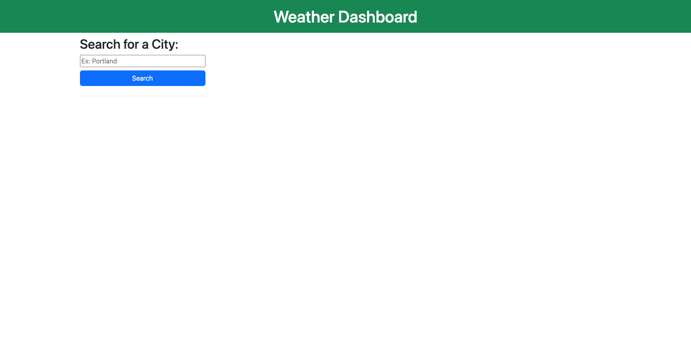

# 5-Day Weather App

## Description

This challenge was to build a 5-Day Weather App that utilizes API data to dynamically create items that will provide the user with a forcast.

- The goal of this project is to use APIs to make this app functional.

## Installation

N/A

## Usage

TODO: Link for the site:

## Credits

README reference: https://coding-boot-camp.github.io/full-stack/github/professional-readme-guide

## License

This project is under the 

## Features

This project updates with the time of day and allows you to plan accordingly.

## Tests

Test this functionality by putting in your events and hitting the save icon on the right. Refresh your browser and see if it persists.
