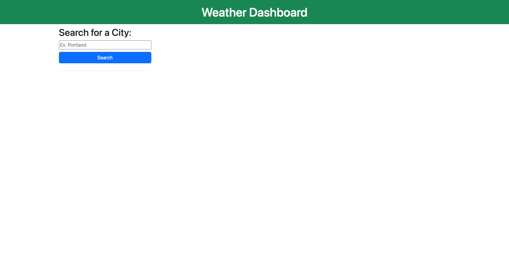

# 5-Day Weather App

## Description

This challenge was to build a 5-Day Weather App that utilizes API data to dynamically create items that will provide the user with a forecast.

- The goal of this project is to use APIs to make this app functional.

## Installation

N/A

## Usage

Link for the site: https://rtcottle.github.io/weather/

## Credits

README reference: https://coding-boot-camp.github.io/full-stack/github/professional-readme-guide

Weather API: https://openweathermap.org/forecast5#format
Geocoding API: https://openweathermap.org/api/geocoding-api

Icon help: https://stackoverflow.com/questions/44177417/how-to-display-openweathermap-weather-icon

DayJS: https://day.js.org/en/

## License

This project is under the 

## Features

This project displays the weather basics for the desired location for the current day and 5 forecasted days.

## Tests

Test this functionality by putting in your desired city name and hitting search!
